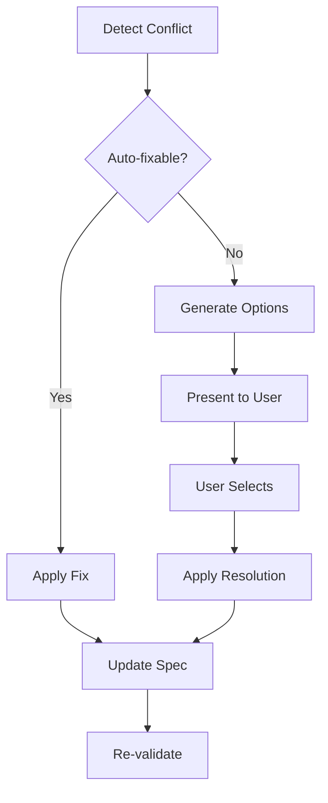

# Specification Consistency Checker

Analyzes your specification for internal contradictions, dependency issues, and conflicting requirements.

## Usage

```bash
/check-consistency                    # Check current scope.json
/check-consistency --deep             # Include cross-slice validation
/check-consistency --fix              # Suggest resolutions for conflicts
/check-consistency --dependencies     # Focus on dependency chain validation
```

## What It Checks

### 1. **Dependency Validation**
- Circular dependencies
- Missing dependencies
- Incorrect dependency order
- Parallel conflicts
- Resource contention

### 2. **Data Model Consistency**
- Field type mismatches
- Conflicting validation rules
- Schema evolution conflicts
- Foreign key integrity
- Naming convention violations

### 3. **API Contract Alignment**
- Request/response mismatches
- Conflicting endpoint definitions
- Inconsistent error codes
- Version compatibility issues
- Rate limit conflicts

### 4. **State Machine Validation**
- Invalid state transitions
- Unreachable states
- Missing transition handlers
- Conflicting state definitions
- Timeout conflicts

### 5. **Business Rule Conflicts**
- Contradictory conditions
- Overlapping rules
- Priority conflicts
- Calculation inconsistencies
- Threshold violations

## Output Format

### Consistency Report

```yaml
consistency_report:
  summary:
    total_slices: 8
    conflicts_found: 3
    severity: "High"
    can_proceed: false
  
  conflicts:
    - type: "Circular Dependency"
      severity: "Critical"
      slices: ["auth-session", "user-profile"]
      description: "auth-session depends on user-profile which depends on auth-session"
      resolution: "Extract shared functionality to auth-core slice"
    
    - type: "Data Model Conflict"
      severity: "High"
      location: "user.email field"
      conflict:
        slice_1: "auth-login"
        definition_1: "varchar(255) unique not null"
        slice_2: "user-profile"
        definition_2: "varchar(100) not null"
      resolution: "Standardize to varchar(255) across all slices"
    
    - type: "API Contract Mismatch"
      severity: "Medium"
      endpoint: "/api/user/{id}"
      conflict:
        slice_1: "user-profile"
        response_1: "{id, email, name, created_at}"
        slice_2: "admin-panel"
        response_2: "{id, email, full_name, registration_date}"
      resolution: "Align field names: name→full_name, created_at→registration_date"
```

### Dependency Matrix

```yaml
dependency_matrix:
  slices:
    auth-core:
      depends_on: []
      depended_by: ["auth-login", "auth-session", "user-profile"]
      can_parallel: false
    
    auth-login:
      depends_on: ["auth-core"]
      depended_by: ["dashboard", "admin-panel"]
      can_parallel: true
    
    dashboard:
      depends_on: ["auth-login", "user-profile"]
      depended_by: []
      can_parallel: true
  
  execution_order:
    phase_1: ["auth-core"]
    phase_2: ["auth-login", "user-profile"]  # Can run in parallel
    phase_3: ["dashboard", "admin-panel"]     # Can run in parallel
  
  critical_path: ["auth-core", "auth-login", "dashboard"]
  estimated_duration: "5 days"
```

## Consistency Rules

### Rule Categories

```yaml
rules:
  naming_conventions:
    - pattern: "snake_case for database fields"
    - pattern: "camelCase for API fields"
    - pattern: "PascalCase for components"
    - pattern: "UPPER_SNAKE for constants"
  
  data_types:
    - id_fields: "UUID v4"
    - timestamps: "ISO 8601 UTC"
    - currency: "Decimal(10,2)"
    - percentages: "Decimal(5,2)"
  
  validation_patterns:
    - email: "RFC 5322"
    - phone: "E.164 format"
    - urls: "Valid HTTP/HTTPS"
    - dates: "YYYY-MM-DD"
  
  error_codes:
    - auth: "AUTH_XXX"
    - validation: "VAL_XXX"
    - system: "SYS_XXX"
    - business: "BIZ_XXX"
```

## Common Inconsistencies

### 1. Circular Dependencies
```yaml
problem:
  A → B → C → A
  
solution:
  Extract common: D
  A → D, B → D, C → D
```

### 2. Field Type Mismatch
```yaml
problem:
  Table A: user_id INTEGER
  Table B: user_id VARCHAR(36)
  
solution:
  Standardize: user_id UUID
```

### 3. State Conflicts
```yaml
problem:
  Order: pending → processing → shipped
  Payment: pending → completed → shipped
  
solution:
  Separate concerns:
  Order: pending → processing → shipped
  Payment: pending → authorized → captured
```

### 4. API Version Conflicts
```yaml
problem:
  v1: POST /users {name, email}
  v2: POST /users {firstName, lastName, email}
  
solution:
  Versioning strategy:
  - v1: Deprecated, redirect to v2
  - v2: Transform v1 requests
```

### 5. Business Rule Conflicts
```yaml
problem:
  Rule A: "Discount if amount > 100"
  Rule B: "No discount if amount > 100"
  
solution:
  Priority system:
  - Rule A: priority=1, condition=amount>100 AND customer_type='regular'
  - Rule B: priority=2, condition=amount>100 AND customer_type='new'
```

## Resolution Strategies

### Automatic Fixes

```yaml
auto_resolvable:
  - naming_convention_violations
  - missing_default_values
  - incomplete_error_codes
  - missing_test_scenarios

manual_review_required:
  - circular_dependencies
  - conflicting_business_rules
  - state_machine_conflicts
  - security_policy_violations
```

### Conflict Resolution Process



## Integration Points

### With Other Commands

```bash
# Complete validation workflow
/scope #1                      # Generate initial scope
/check-consistency             # Find conflicts
/spec-enhance --fix-conflicts  # Resolve conflicts
/check-consistency --verify    # Verify resolution
/spec-score                    # Confirm quality
/accept-scope                  # Proceed
```

### Validation Levels

| Level | Checks | When to Use | Blocking |
|-------|--------|-------------|----------|
| **Quick** | Basic syntax | During editing | No |
| **Standard** | Dependencies + Data | Before review | Yes for Critical |
| **Deep** | All rules + Cross-refs | Before acceptance | Yes for High+ |
| **Strict** | Everything + Best practices | Production | Yes for Medium+ |

## Best Practices

1. **Run Early and Often**: Check consistency after each major change
2. **Fix Critical First**: Address blocking issues before proceeding
3. **Document Decisions**: Record why conflicts were resolved a certain way
4. **Maintain Standards**: Use consistent patterns across all slices
5. **Version Everything**: Track how consistency rules evolve
6. **Automate Checks**: Include in CI/CD pipeline
7. **Review Manual Fixes**: Have human verify conflict resolutions

## Example Workflow

```bash
# Initial scope generation
/scope https://github.com/user/repo/issues/1

# Check for issues
/check-consistency
# Output: 3 conflicts found

# Review dependency issues
/check-consistency --dependencies
# Output: Circular dependency detected

# Get resolution suggestions
/check-consistency --fix
# Output: Suggested extractions and refactoring

# Apply fixes
/spec-enhance --fix-conflicts

# Verify resolution
/check-consistency
# Output: All checks passed ✅

# Proceed with confidence
/accept-scope
```

## Quality Gates

### Must Pass Before Development
- [ ] No circular dependencies
- [ ] No data type conflicts
- [ ] No API contract mismatches
- [ ] All states reachable
- [ ] No conflicting business rules

### Should Fix Before Production
- [ ] Naming conventions consistent
- [ ] Error codes follow pattern
- [ ] Test coverage complete
- [ ] Documentation aligned
- [ ] Performance targets compatible