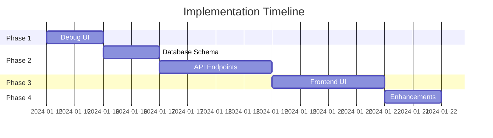
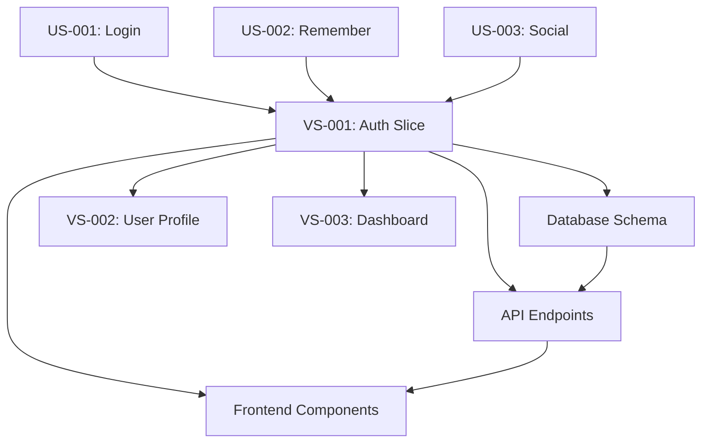

# Story to Slice Mapper

Maps user stories to vertical slices, creating implementation plans with clear phases, agent sequences, and test coverage.

## Usage

```bash
/story-to-slice US-001 US-002 US-003         # Create slice from stories
/story-to-slice --analyze                    # Analyze story relationships
/story-to-slice --optimize                   # Optimize slice boundaries
/story-to-slice --from-epic "Analytics"      # Create slices for epic
```

## What It Generates

### 1. Vertical Slice Definition

```yaml
# slices/VS-001-[name]/slice.yaml
slice:
  id: VS-001
  name: "User Authentication"
  description: "Complete authentication flow with login, logout, and session management"
  priority: P0
  size: L
  risk: Medium
  
user_stories:
  primary:
    - id: US-001
      title: "User login with email/password"
      points: 5
      critical: true
  
  secondary:
    - id: US-002
      title: "Remember me functionality"
      points: 2
      critical: false
  
  optional:
    - id: US-003
      title: "Social login"
      points: 3
      critical: false

story_points_total: 10
story_points_critical: 5

implementation_phases:
  phase_1_debug:
    name: "Debug UI & Basic Flow"
    duration: "1 day"
    stories: [US-001]
    deliverables:
      - Debug login form at /debug/auth
      - Mock authentication service
      - Session state viewer
      - Manual test interface
    success_criteria:
      - Can login with test credentials
      - Session state visible in debug UI
      - Can manually trigger auth states
  
  phase_2_backend:
    name: "Core Authentication Logic"
    duration: "2 days"
    stories: [US-001, US-002]
    deliverables:
      - User model and database schema
      - Login/logout API endpoints
      - JWT token generation
      - Session management
      - Password hashing
    success_criteria:
      - Authentication endpoints working
      - Tokens properly generated
      - Sessions persist correctly
  
  phase_3_frontend:
    name: "Production UI"
    duration: "2 days"
    stories: [US-001, US-002]
    deliverables:
      - Login page component
      - Session management hooks
      - Protected route wrapper
      - Remember me checkbox
    success_criteria:
      - Professional login UI
      - Smooth authentication flow
      - Proper error handling
  
  phase_4_enhancement:
    name: "Optional Features"
    duration: "1 day"
    stories: [US-003]
    deliverables:
      - Social login integration
      - Two-factor authentication
    success_criteria:
      - Social providers working
      - 2FA flow complete

dependencies:
  internal: []
  external:
    - "Database connection"
    - "Redis for sessions"
  
agent_sequence:
  - agent: architect
    phase: planning
    task: "Design authentication architecture"
    duration: "2 hours"
  
  - agent: dba
    phase: phase_2_backend
    task: "Create user and session tables"
    duration: "1 hour"
  
  - agent: backend
    phase: phase_2_backend
    task: "Implement auth endpoints and logic"
    duration: "4 hours"
  
  - agent: frontend
    phase: phase_3_frontend
    task: "Build login UI and session management"
    duration: "4 hours"
  
  - agent: security
    phase: all
    task: "Security review and hardening"
    duration: "2 hours"

test_coverage:
  unit_tests:
    - password_hashing
    - token_generation
    - session_validation
  
  integration_tests:
    - login_flow
    - logout_flow
    - session_persistence
  
  acceptance_tests:
    - US-001: test_user_can_login
    - US-002: test_remember_me_works
    - US-003: test_social_login
  
  e2e_tests:
    - complete_auth_journey
    - session_timeout_handling

parallel_work:
  can_parallelize:
    - frontend_components
    - api_documentation
    - test_creation
  
  must_sequence:
    - database_schema -> api_endpoints
    - api_endpoints -> frontend_integration
```

### 2. Implementation Roadmap

```markdown
# Implementation Roadmap: VS-001

## Overview
Vertical slice delivering user authentication functionality through incremental phases.

## Phase Timeline


## Daily Breakdown

### Day 1: Debug Foundation
- [ ] Morning: Create debug UI at /debug/auth
- [ ] Afternoon: Build test data generators
- [ ] End of day: Demo debug interface

### Day 2-3: Backend Implementation
- [ ] Day 2 AM: Database schema and migrations
- [ ] Day 2 PM: Auth service and API endpoints
- [ ] Day 3 AM: Session management
- [ ] Day 3 PM: Integration testing

### Day 4-5: Frontend Polish
- [ ] Day 4: Login page and components
- [ ] Day 5 AM: Session hooks and protection
- [ ] Day 5 PM: Error handling and polish

### Day 6: Enhancements
- [ ] Optional: Social login
- [ ] Optional: Two-factor auth

## Success Metrics
- All acceptance tests passing
- < 200ms login response time
- Zero security vulnerabilities
- 100% critical story completion
```

### 3. Test Matrix

```yaml
# slices/VS-001/test-matrix.yaml
test_matrix:
  stories:
    US-001:
      acceptance_tests:
        - test_login_with_valid_credentials
        - test_login_with_invalid_credentials
        - test_login_rate_limiting
      debug_ui_tests:
        - test_debug_login_form_renders
        - test_debug_session_viewer_works
      unit_tests:
        - test_password_validation
        - test_email_validation
    
    US-002:
      acceptance_tests:
        - test_remember_me_extends_session
        - test_remember_me_survives_restart
      debug_ui_tests:
        - test_debug_cookie_inspector
      unit_tests:
        - test_persistent_token_generation
    
    US-003:
      acceptance_tests:
        - test_google_oauth_flow
        - test_github_oauth_flow
      debug_ui_tests:
        - test_debug_oauth_state_viewer
      unit_tests:
        - test_oauth_token_exchange

  coverage_report:
    total_stories: 3
    stories_with_tests: 3
    total_tests: 15
    test_types:
      acceptance: 7
      debug_ui: 4
      unit: 4
    coverage_percentage: 100%
```

### 4. Dependency Graph



## Slice Optimization

### Analyzing Story Relationships

```yaml
analysis:
  story_clusters:
    authentication:
      stories: [US-001, US-002, US-003]
      cohesion: high
      coupling: low
      recommendation: "Single slice"
    
    user_management:
      stories: [US-004, US-005, US-006]
      cohesion: medium
      coupling: medium
      recommendation: "Consider splitting"
  
  dependencies:
    US-001:
      depends_on: []
      blocks: [US-004, US-007]
      related: [US-002, US-003]
    
    US-002:
      depends_on: [US-001]
      blocks: []
      related: [US-003]
  
  optimal_slices:
    - slice: VS-001
      stories: [US-001, US-002, US-003]
      rationale: "Cohesive authentication flow"
    
    - slice: VS-002
      stories: [US-004, US-005]
      rationale: "User profile management"
```

### Slice Sizing Guidelines

```yaml
sizing:
  small_slice:
    story_points: 1-5
    duration: 1-2 days
    stories: 1-2
    team_size: 1 developer
  
  medium_slice:
    story_points: 6-13
    duration: 3-5 days
    stories: 2-4
    team_size: 1-2 developers
  
  large_slice:
    story_points: 14-21
    duration: 1-2 weeks
    stories: 4-6
    team_size: 2-3 developers
  
  warning_signs:
    - "More than 21 story points"
    - "More than 6 stories"
    - "More than 2 weeks"
    - "Unclear boundaries"
```

## Integration Patterns

### With Debug UI

```typescript
// apps/web/app/debug/[slice]/page.tsx
export default function DebugSlicePage() {
  const slice = getSliceData('VS-001');
  const stories = slice.user_stories;
  
  return (
    <DebugLayout title={`Slice: ${slice.name}`}>
      {/* Story Progress */}
      <div className="grid grid-cols-3 gap-4 mb-6">
        {stories.map(story => (
          <StoryCard
            key={story.id}
            story={story}
            status={getStoryStatus(story.id)}
          />
        ))}
      </div>
      
      {/* Phase Progress */}
      <PhaseTracker phases={slice.implementation_phases} />
      
      {/* Test Coverage */}
      <TestCoverageMatrix slice={slice} />
      
      {/* Debug Tools */}
      <div className="grid grid-cols-2 gap-4">
        <DebugPanel title="API Tester" />
        <DebugPanel title="State Inspector" />
      </div>
    </DebugLayout>
  );
}
```

### With Acceptance Tests

```python
# tests/slices/test_vs_001.py
@pytest.mark.slice("VS-001")
class TestAuthenticationSlice:
    """Tests for VS-001: User Authentication"""
    
    def test_all_stories_covered(self):
        """Verify all stories in slice have tests"""
        slice_data = load_slice("VS-001")
        for story in slice_data["user_stories"]["primary"]:
            assert has_acceptance_test(story["id"])
    
    def test_phase_1_debug_ui(self):
        """Phase 1: Debug UI is functional"""
        response = client.get("/debug/auth")
        assert response.status_code == 200
    
    def test_phase_2_backend(self):
        """Phase 2: Backend endpoints work"""
        # Test each backend deliverable
        pass
    
    def test_complete_slice_flow(self):
        """End-to-end slice functionality"""
        # Test the complete user journey
        pass
```

## Workflow Integration

### Complete Development Flow

```bash
# 1. Create user stories
/user-story "As a user, I want to login"
/user-story "As a user, I want to stay logged in"

# 2. Map to slice
/story-to-slice US-001 US-002
# Output: Created VS-001

# 3. Generate debug UI
/debug-ui VS-001

# 4. Generate tests
/acceptance-test VS-001

# 5. Start implementation
/issue --from-slice VS-001

# 6. Follow agent sequence
/architect Design auth flow
/dba Create user tables
/backend Implement auth API
/frontend Build login UI
/security Review implementation

# 7. Verify completion
/run-acceptance VS-001
```

## Best Practices

1. **Right-size slices**: Aim for 3-5 day completion
2. **Group related stories**: High cohesion, low coupling
3. **Define clear phases**: Debug → Backend → Frontend → Polish
4. **Map dependencies**: Identify blockers early
5. **Plan parallel work**: Maximize efficiency
6. **Test each phase**: Don't wait until the end
7. **Document decisions**: Record why stories are grouped
8. **Track progress**: Update phase completion daily

## Output Structure

```
slices/
├── VS-001-authentication/
│   ├── slice.yaml              # Slice definition
│   ├── roadmap.md              # Implementation plan
│   ├── test-matrix.yaml        # Test coverage
│   ├── stories/
│   │   ├── US-001.md          # Linked stories
│   │   └── US-002.md
│   ├── debug-ui/
│   │   └── auth-debug.tsx     # Debug interface
│   ├── tests/
│   │   ├── acceptance/
│   │   └── integration/
│   └── docs/
│       └── implementation.md
```

## Metrics and Reporting

```yaml
# .claude/metrics/slices.yaml
slices:
  total: 10
  by_status:
    not_started: 3
    in_progress: 2
    completed: 5
  by_size:
    small: 4
    medium: 4
    large: 2
  velocity:
    average_days: 4.5
    stories_per_slice: 3.2
  test_coverage:
    average: 92%
    fully_tested: 8
```