# 📖 How to Use This Template - Complete Guide

> **The ONLY guide you need** to use the Solo Software Factory template. Follow these steps to build production apps 10x faster with AI.

---

## ⚠️ System Requirements

- **Python**: 3.9 - 3.13+ (automatically handles version differences)
- **Node.js**: 18+
- **PostgreSQL**: 14+
- **Redis**: 6+

## 🎯 What This Template Does

This template gives you:
- **AI agents** that write code for you (Backend, Frontend, Database, etc.)
- **Quality gates** that ensure professional code
- **Automated workflows** that handle the boring stuff
- **Modern tech stack** (FastAPI + Next.js + PostgreSQL)
- **Dark theme UI** with glass morphism design

---

## ⚠️ IMPORTANT: Disconnect from Template Repo First!

When you clone this template, you're still connected to the template repository. You MUST disconnect before starting work:

```bash
./setup-new-project.sh  # Run this immediately after cloning!
```

This script will:
- ✅ Remove connection to template repository
- ✅ Initialize YOUR own git repository
- ✅ Prevent accidental commits to template
- ✅ Personalize the project for you

## 🚀 Quick Start (15 minutes to your first feature)

### Step 1: Clone and Setup (3 minutes)

```bash
# 1. Clone the template
git clone [template-url] my-awesome-app
cd my-awesome-app

# 2. Run the setup script (IMPORTANT: This disconnects from template repo)
./setup-new-project.sh
# This will:
#   - Remove template git history
#   - Initialize YOUR own repository
#   - Personalize project files
#   - Create .env from example
#   - Optionally install dependencies
#   - Create initial commit

# 3. Start development
make dev      # Starts everything

# If you encounter dependency issues:
./install.sh  # Handles common installation problems
```

**Alternative Manual Setup:**
```bash
# If you prefer to do it manually:
rm -rf .git                    # Remove template repo
git init                        # Start fresh
cp .env.example .env            # Setup environment
./install.sh                    # Better than 'make install' - handles issues
git add .
git commit -m "Initial commit"
```

**If Installation Fails:**
```bash
# Use the enhanced install script that handles common issues:
./install.sh
# This will:
# - Detect your OS
# - Upgrade pip/setuptools
# - Handle psycopg2/pydantic build errors
# - Install dependencies with fallbacks
```

### Step 2: Verify Everything Works (2 minutes)

Open in your browser:
- ✅ http://localhost:3000 - You should see the app
- ✅ http://localhost:8000/docs - You should see API docs

If ports are busy, change them in `.env`:
```env
WEB_PORT=3001
API_PORT=8001
```

### Step 3: Build Your First Feature (10 minutes)

```bash
# 1. Open Claude Code
claude

# 2. Tell Claude what you want to build
/spec-to-stories "I want a task management system where users can create, 
edit, delete tasks, mark them complete, and see a dashboard"

# This generates multiple user stories. Pick one to start:
/user-story "As a user, I want to create tasks"

# 3. Build it incrementally
/story-ui US-001 --step 1  # See raw data immediately
/backend Create CRUD API for tasks
/story-ui US-001 --step 2  # Add basic UI
/frontend Build task creation form
/story-ui US-001 --step 3  # Structure components
/story-ui US-001 --step 4  # Apply beautiful design

# 4. Ship it
git add .
git commit -m "feat: Task creation (US-001)"
git push
```

**That's it!** You just built a feature with AI assistance.

---

## 📚 Complete Workflow

### The Process: Idea → Story → Build → Ship

```mermaid
graph LR
    A[💡 Idea] --> B[📝 User Story]
    B --> C[✅ Quality Check]
    C --> D[🔧 Build Incrementally]
    D --> E[🚀 Ship]
```



### Phase 1: Define What You're Building

```bash
# Option A: Multiple stories from a spec
/spec-to-stories "Your app idea or requirements"

# Option B: Single story
/user-story "As a [user], I want to [action] so that [benefit]"

# Check quality (MUST be ≥ 7.0)
/spec-score
/spec-enhance  # Auto-improve if score is low
```

### Phase 2: Build Incrementally

```bash
# Start with raw data (see it works)
/story-ui US-001 --step 1

# Build the backend
/architect How should I structure this?
/dba Create the database schema
/backend Build the API endpoints

# Add UI progressively
/story-ui US-001 --step 2  # Basic interactions
/frontend Create the components
/story-ui US-001 --step 3  # Proper structure
/story-ui US-001 --step 4  # Beautiful polish
```

### Phase 3: Test and Ship

```bash
# Generate and run tests
/acceptance-test US-001
make test

# Security review
/security Review my implementation

# Commit with story reference
git add .
git commit -m "feat: [Description] (US-001)"
git push  # Auto-deploys if configured
```

---

## 🤖 AI Agents Reference

You have 6 specialized AI agents at your command:

| Agent | Command | What It Does | Example |
|-------|---------|--------------|---------|
| **PM** | `/pm` | Plans features, writes stories | `/pm Help me plan a dashboard` |
| **Architect** | `/architect` | Designs system architecture | `/architect Best way to handle real-time?` |
| **DBA** | `/dba` | Creates database schemas | `/dba Design user preferences table` |
| **Backend** | `/backend` | Builds APIs with FastAPI | `/backend Create auth endpoints` |
| **Frontend** | `/frontend` | Builds UI with React/Next.js | `/frontend Build responsive navbar` |
| **Security** | `/security` | Reviews code for vulnerabilities | `/security Check my auth flow` |

---

## 📝 Essential Commands

### Planning Commands
```bash
/spec-to-stories "idea"    # Generate multiple stories
/user-story "As a..."      # Create single story
/spec-score                # Check quality (must be ≥7.0)
/spec-enhance              # Auto-improve specs
/parallel-strategy         # See what can be done in parallel
```

### Development Commands
```bash
/story-ui US-001          # Build UI in 4 steps
/acceptance-test US-001   # Generate tests
/issue #5                 # Work on GitHub issue
/db-setup                 # Connect to existing database
```

### Utility Commands
```bash
make dev                  # Start everything
make test                 # Run all tests
make logs                 # View logs
/help                     # Get help
```

---

## 🎨 Using the Design System

The template includes a beautiful dark theme with glass morphism:

```tsx
// Components are ready to use
import { Button, Card, StatCard } from '@/design-system/components';

// Example usage
<Card variant="glass" glow>
  <h2>Dashboard</h2>
  <StatCard 
    title="Total Tasks" 
    value={42}
    change={{ value: 5, trend: 'up' }}
  />
  <Button variant="primary" glow>
    Create Task
  </Button>
</Card>
```

---

## 🚢 Deployment

### Option 1: Deploy to Railway (Easiest)

1. Push your code to GitHub
2. Connect Railway to your repo
3. Add environment variables
4. Deploy!

### Option 2: Deploy to GCP Cloud Run

1. Set up GCP project
2. Add GitHub secrets:
   - `GCP_PROJECT_ID`
   - `GCP_SA_KEY`
3. Push to main branch (auto-deploys)

### Option 3: Any Docker Host

```bash
docker-compose -f docker-compose.prod.yml up
```

---

## 📋 Project Structure

```
my-app/
├── .claude/              # AI configuration
│   ├── agents/           # Agent definitions
│   ├── commands/         # Custom commands
│   └── hooks/            # Automation scripts
├── apps/
│   ├── api/             # FastAPI backend
│   └── web/             # Next.js frontend
├── design-system/        # UI components
├── user-stories/         # Your requirements
├── .env                  # Environment variables
└── HOW_TO_USE.md        # This file!
```

---

## ⚠️ Important Rules

### ✅ DO These Things

1. **Always start with a user story** - Clear requirements save time
2. **Build UI incrementally** - Start with raw data, polish later
3. **Keep quality score ≥ 7.0** - Prevents bugs and rework
4. **Commit with story references** - Like `(US-001)` in message
5. **Test as you build** - Don't wait until the end

### ❌ DON'T Do These Things

1. **Don't skip user stories** - You'll build the wrong thing
2. **Don't build complete UI first** - You'll waste time if API changes
3. **Don't ignore quality scores** - Technical debt will kill you
4. **Don't forget to commit** - You'll lose work
5. **Don't skip tests** - Bugs are expensive

---

## 🔧 Troubleshooting

### "Port already in use"
```bash
# Change ports in .env
WEB_PORT=3001
API_PORT=8001
```

### "Quality score too low"
```bash
/spec-enhance  # Auto-improves your spec
```

### "Can't see my UI"
```bash
# Make sure you're at the right step
/story-ui US-001 --step 1  # Start here
# Check: http://localhost:3000/[feature-name]
```

### "Tests failing"
```bash
/acceptance-test US-001  # Regenerate tests
make test               # Run them
```

---

## 💡 Pro Tips

### Speed Tips
1. **Use `/spec-to-stories`** for complete feature sets
2. **Run `/parallel-strategy`** to work on multiple things
3. **Start with step 1 UI** to validate immediately
4. **Batch similar work** (all DB, then all API, then all UI)

### Quality Tips
1. **Never accept score < 7.0** - It will bite you later
2. **Write tests with `/acceptance-test`** - It's automatic!
3. **Run `/security`** before shipping anything important
4. **Document decisions** in `.claude/DECISIONS.md`

### Workflow Tips
1. **One story at a time** - Focus wins
2. **Commit often** - Every small win
3. **Use story IDs** - In commits, PRs, everywhere
4. **Update PROJECT_STATE.md** - Track progress

---

## 📊 What Success Looks Like

After using this template correctly, you'll have:

- ✅ Clear user stories with acceptance criteria
- ✅ Quality score ≥ 7.0 on all specs
- ✅ Working features built incrementally
- ✅ Tests that actually test the right things
- ✅ Beautiful UI with dark theme
- ✅ Clean git history with story references
- ✅ Deployed app running in production

---

## 🆘 Getting Help

1. **In Claude Code**: Type `/help`
2. **Check memory files**: `.claude/LEARNED_PATTERNS.md` for solutions
3. **Review decisions**: `.claude/DECISIONS.md` for architecture
4. **Check the logs**: `make logs`

---

## 🎯 Your First Week Checklist

- [ ] Day 1: Setup and first feature
- [ ] Day 2: Add 3-5 more features
- [ ] Day 3: Polish UI with design system
- [ ] Day 4: Add tests and security review
- [ ] Day 5: Deploy to production
- [ ] Day 6: Add monitoring and analytics
- [ ] Day 7: Plan next week's features

---

## 🚀 Ready to Build?

You now know everything you need. Remember:

1. **Start with a story** (`/user-story`)
2. **Check quality** (`/spec-score` ≥ 7.0)
3. **Build incrementally** (`/story-ui` steps 1-4)
4. **Ship with confidence** (`git push`)

**Now go build something amazing!** 💪

---

*This is the ONLY instructions file you need. Everything else is implementation details.*
*Questions? The AI agents know this system - just ask them!*