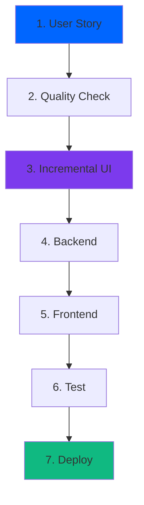

# 🚀 Quick Start Guide - Solo Software Factory

> **From zero to working feature in 15 minutes**

---

## 📦 Initial Setup (3 minutes)

```bash
# 1. Clone template
git clone [template-url] my-app
cd my-app

# 2. Quick setup
cp .env.example .env
make install  # Or run install commands manually
make dev

# 3. Verify everything works
open http://localhost:3000        # Frontend
open http://localhost:8000/docs   # API docs
```

---

## 🎯 Your First Feature (12 minutes)

Let's build a **Task Management** feature as an example:

### **Step 1: Define What You're Building** (2 min)

```bash
claude  # Open Claude Code

/user-story "As a user, I want to manage my tasks with a todo list"
```

**Output:** Creates `US-001-manage-tasks.md` with:
- ✅ Acceptance criteria
- 🧪 Test scenarios
- 📋 Technical requirements

### **Step 2: Check Quality** (1 min)

```bash
/spec-score

# If score < 7.0:
/spec-enhance  # Auto-improve
/spec-score    # Check again
```

### **Step 3: Start Incremental UI** (2 min)

```bash
/story-ui US-001 --step 1
```

**Visit:** http://localhost:3000/tasks

You'll see:
- 📊 Raw data display (Step 1)
- → Basic interactions (Step 2)
- → Structured components (Step 3)
- → Polished with design system (Step 4)

### **Step 4: Build the Backend** (3 min)

```bash
# Create database schema
/dba Create a tasks table with: id, title, description, completed, created_at

# Build API
/backend Create CRUD endpoints for tasks:
- GET /api/v1/tasks (list all)
- POST /api/v1/tasks (create)
- PUT /api/v1/tasks/{id} (update)
- DELETE /api/v1/tasks/{id} (delete)
```

### **Step 5: Build the Frontend** (3 min)

```bash
# Continue with incremental UI
/story-ui US-001 --step 2  # Add basic interactions

/frontend Create a task list page using our design system:
- Use Card component for task container
- Use Button for add/delete actions
- Use the glass morphism style
- Add real-time updates

/story-ui US-001 --step 3  # Structure components
/story-ui US-001 --step 4  # Apply final polish
```

### **Step 6: Test & Ship** (1 min)

```bash
# Generate and run tests
/acceptance-test US-001
/run-acceptance US-001

# Commit and deploy
git add .
git commit -m "feat: Task management (US-001)"
git push
```

---

## ✅ What You Just Built

In 15 minutes, you created:

1. **Complete Specification** with acceptance criteria
2. **Incremental UI** built in 4 progressive steps
3. **Database Schema** with migrations
4. **RESTful API** with full CRUD
5. **Modern UI** with dark theme & glass morphism
6. **Automated Tests** from acceptance criteria
7. **Production Deployment** ready to ship

---

## 🎨 Using the Design System

The template includes a **dark theme** with **glass morphism**:

```tsx
// Beautiful components ready to use
import { Card, Button, StatCard } from '@/design-system/components';

<Card variant="glass" glow>
  <StatCard 
    title="Total Tasks" 
    value={tasks.length}
    change={{ value: 5, trend: 'up' }}
  />
  <Button variant="primary" glow>
    Add Task
  </Button>
</Card>
```

---

## 🤖 Available AI Agents

| Need | Use | Example |
|------|-----|---------|
| **Planning** | `/pm` | `/pm Help me plan a dashboard feature` |
| **Architecture** | `/architect` | `/architect Best way to handle real-time updates?` |
| **Database** | `/dba` | `/dba Design schema for user preferences` |
| **Backend** | `/backend` | `/backend Create authentication system` |
| **Frontend** | `/frontend` | `/frontend Build responsive navigation` |
| **Security** | `/security` | `/security Review my auth implementation` |

---

## 📊 The Complete Workflow



---

## 🔥 Pro Tips

### **Speed Tips**
- **Start with raw data UI** - See API response immediately
- **Use parallel work** - Run `/parallel-strategy` to see what can be done simultaneously
- **Test continuously** - Don't wait until the end

### **Quality Tips**
- **Keep spec score ≥ 7.0** - Ensures clear requirements
- **Define all terms** - Run `/define-terms` for glossary
- **Review with security** - Always run `/security` before shipping

### **Incremental UI Benefits**
- **Step 1**: Validate API integration instantly
- **Step 2**: Test interactions before styling
- **Step 3**: Ensure proper component structure
- **Step 4**: Apply polish only after functionality works

---

## 📚 Next Steps

### **Learn More**
- [Complete Workflow Guide](docs/COMPLETE_WORKFLOW_GUIDE.md) - Detailed processes
- [Design System](design-system/DESIGN_SYSTEM.md) - Component library
- [Command Reference](docs/COMMANDS.md) - All commands explained

### **Build More Features**
```bash
# Authentication
/user-story "As a user, I want to login securely"

# Dashboard
/user-story "As a user, I want to see my metrics"

# Reports
/user-story "As a user, I want to export reports"
```

### **Customize**
- Modify design tokens in `design-system/tokens.ts`
- Add new AI agents in `.claude/agents/`
- Create custom commands in `.claude/commands/`

---

## 🆘 Common Issues

### **Port Already in Use**
```bash
# Change ports in .env
API_PORT=8001
WEB_PORT=3001
```

### **Quality Score Too Low**
```bash
/spec-enhance  # Auto-improve
/define-terms  # Add definitions
```

### **Can't See UI Steps**
```bash
# Make sure you ran
/story-ui US-001 --step 1
# Then visit
http://localhost:3000/[feature-name]
# Check step files in apps/web/app/[feature]/
```

---

## 🎉 Success Checklist

After using the template, you should have:

- [ ] User story created with `/user-story`
- [ ] Quality score ≥ 7.0 with `/spec-score`
- [ ] Incremental UI started with `/story-ui --step 1`
- [ ] Backend API working
- [ ] All 4 UI steps completed
- [ ] Tests passing
- [ ] Code committed with story reference
- [ ] Feature deployed

---

## 💬 Get Help

- **Commands Help**: Type `/help` in Claude Code
- **UI Issues**: Check step files in `apps/web/app/[feature]/`
- **View Logs**: Run `make logs`
- **Community**: [Discord](https://discord.gg/solo-software)

---

**🎯 Remember:** The magic is in the incremental process:
1. **Story first** (clear requirements)
2. **Raw data second** (verify API works)
3. **Progressive enhancement** (build in 4 steps)
4. **Ship fast** (with confidence)

Happy building! 🚀